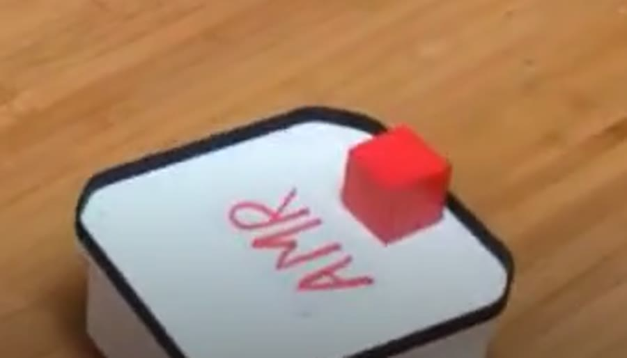

# PathOn AMR — Autonomous Mobile Robot

> **Status: placeholder — no files released yet.** The AMR is built and running: it appears
> in the Smart Logistics Cell demo, driving itself between work cells with a load on its
> deck. What does not exist yet is anything you could build one from — no CAD, no BOM, no
> STLs, no bringup code. The photo below is a frame from that demo, not a render.

A small autonomous mobile robot that handles **delivery between work cells** in the PathOn
**Smart Logistics Cell** (SLC). An arm transfers the load onto its deck, and the AMR drives
itself to the next station — it holds a map, plans its own path, and can route around an
obstacle that appears in front of it.

*The AMR mid-run in the Smart Logistics Cell, carrying a block between stations.*

## What it does in the cell

| | |
|---|---|
| **Job** | Delivery between work cells — the long leg of the line |
| **Navigation** | Nav2: builds and localizes against a map, plans its own path |
| **Handoff** | An arm loads it at the origin cell; it drives to the next station |
| **Obstacles** | Replans around them |
| **Trade-off** | More capable and more complex — mapping, localization, and planning all have to work |

## The point of shipping both

The SLC deliberately runs an AMR **and** a [line-following AGV](../agv/) on the same line,
because choosing between them is the decision a real plant makes every day:

| | [AGV](../agv/) | AMR (this page) |
|---|---|---|
| Route | Fixed — the line is stuck to the floor | Software; any point-to-point on the map |
| Needs a map | No | Yes |
| Blocked path | Stops and waits | Plans around it |
| Cost and failure modes | Cheap, reliable, few of them | Higher, and mostly software-shaped |
| Changing the route | Re-lay the tape | Edit a goal |

Two vehicles, one work cell, and the difference is visible in a single run: the AGV shuttles
within a cell, the AMR carries between them.

## What a release would contain

- [ ] Chassis and deck CAD, plus printable meshes
- [ ] BOM: drive, wheels, battery, compute, and the lidar it maps with
- [ ] Nav2 configuration — costmaps, planner and controller parameters, tuned for this base
- [ ] Bringup: `ros2_control` interfaces, odometry, teleop fallback
- [ ] The deck interface it shares with the AGV, so loads and fixtures interchange
- [ ] A simulation model of the base and the cell

Interested in this one, or want to be told when it lands?
[Discord](https://discord.gg/xukJ3nh9wC).
