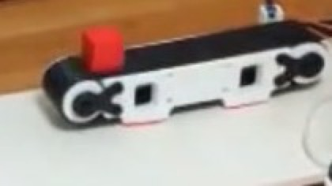

# PathOn Conveyor — Sensor-Triggered Infeed

> **Status: placeholder — no files released yet.** The conveyor is built and running: it is
> the first station in the Smart Logistics Cell demo. What does not exist yet is anything
> you could build one from — no CAD, no printable meshes, no BOM, no firmware. The photo
> below is a frame from that demo, not a render.

A small **3D-printed belt conveyor** that feeds the PathOn **Smart Logistics Cell**. A block
goes on the belt and rides to an IR-monitored pick point, where the sensor firing is what
starts the line.

*The conveyor at the head of the cell, with a block on the belt.*

## What it does in the cell

| | |
|---|---|
| **Job** | Infeed — carries the block to a fixed pick point and says when it has arrived |
| **Drive** | Hobby servo driving the belt |
| **Sensing** | IR beam at the pick point |
| **Controller** | ESP32 |

## The least glamorous part is the one that makes it a line

Robots sitting on a floor are just robots. What makes them a *line* is that finishing one
step starts the next with no one pressing a button — and that begins here, with a beam
breaking at a known point.

It is also the cheapest honest way to teach industrial control: one sensor input, one motor
output, and the logic between them. The rest of the cell reacts to what the sensor reports,
not to a script that assumes how long the belt takes.

## What a release would contain

- [ ] Frame, roller, and pulley CAD, plus printable meshes
- [ ] BOM: servo, IR sensor, ESP32, belt material, fasteners
- [ ] Controller firmware and wiring diagram
- [ ] The handshake: what signal the conveyor raises on arrival, and how a station consumes it
- [ ] Belt tensioning and assembly notes

Interested in this one, or want to be told when it lands?
[Discord](https://discord.gg/xukJ3nh9wC).
