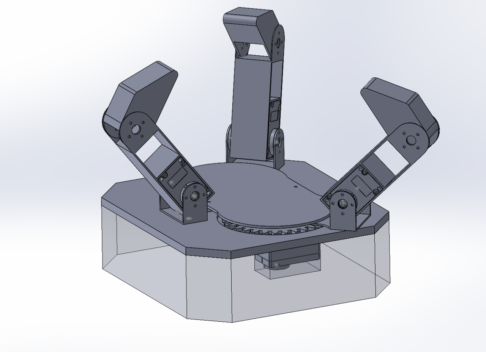

# Pathon Dexterous Hand V3 — Barrett-Style

> **Status: partial release.** The CAD assembly and the first printable meshes are now in this
> folder. Still to come: the pre-arranged 3MF print plate, renders/photos, the URDF/MJCF
> simulation models, and the printed wrist adapter. Everything in the *Target Specs* table below
> is still a **design target**, not an as-built measurement — see
> [What is measured](#what-is-measured).

A 3-finger, **Barrett-style** dexterous hand: high grasp versatility from very few actuators, built around **DYNAMIXEL X-series** servos. This is **V3** of the Pathon Dexterous Hand, following [V1](../v1/) (DYNAMIXEL XL330) and [V2](../v2/) (Feetech SCS0009).

The hand itself is arm-agnostic — the only arm-specific part is the printed wrist adapter. Our reference integration is the AgileX Piper 6-DOF arm; swapping the adapter is what it takes to put it on something else.



*CAD render of the `dex_hand` assembly — three fingers in the open position, the spread gear ring
around the palm, and the spread servo below the mounting plate. The transparent block underneath is
`base_base`, the stock blank, shown for context only. **Render, not a photo** — no hand is built yet.*

## Why Barrett-style

V1 and V2 give one actuator per joint — simple, but the motor count grows with every joint you add and the palm fills up fast. The Barrett Hand (BH8-280/282) is the canonical answer: **8 joints driven by 4 actuators**, where the gap between the two is closed mechanically rather than electrically. V3 takes that topology:

- **3 independent finger-flexion DOF** — one servo per finger, with each finger **underactuated**: the servo drives the proximal link, and a coupling carries the distal link at a fixed ratio until the proximal link stalls against the object, after which the distal link keeps curling. Adaptive, shape-conforming grasps from one motor per finger.
- **1 spread (abduction) DOF** — a single servo synchronously rotates **two of the three fingers** about the palm axis, letting the hand reconfigure between pinch, spherical/wrap, and cylindrical grasps.

Accounting: 3 fingers × 2 joints = 6 finger joints, + 2 spread joints (both on one motor) = **8 joints, 4 motors, 4 actuated DOF**.

Reference: Townsend, *"The BarrettHand grasper — programmably flexible part handling and assembly,"* Industrial Robot, 2000 · <https://barrett.com/barretthand>

## CAD Walkthrough

[`media/cad_walkthrough.mp4`](media/cad_walkthrough.mp4) — a 13-second screen capture of the
`dex_hand` SolidWorks assembly, dragging a finger through its flexion range to show the
proximal + distal link geometry and the spread gear ring in the palm.

> This is a **CAD capture, not a hardware demo** — no physical hand is assembled yet. A demo of a
> built hand is still on the roadmap.

## Target Specs

| Spec | Target |
|---|---|
| **Fingers** | 3 |
| **Joints / actuated DOF** | 8 joints / 4 DOF |
| **Finger actuation** | 1 servo per finger, 2-link underactuated (proximal + distal, breakaway coupling) |
| **Spread DOF** | 1 servo, two fingers mechanically coupled, ~0–180° |
| **Servos** | DYNAMIXEL X-series (XL330-M288-T class baseline) |
| **Protocol** | TTL half-duplex daisy chain |
| **Arm mount** | Printed wrist adapter; reference adapter targets the AgileX Piper tool flange |
| **Mass budget** | ≤ 600 g incl. servos and fasteners — leaves most of a 1.5 kg arm payload for the object |
| **Scale** | Fingers ~100 mm; palm under 150 mm across |
| **Manufacturing** | FDM (PLA / PETG), 256 × 256 mm bed; fasteners, bearings, shafts, springs as standard purchasable parts |

*All values are design targets, not measured results — they will be replaced with as-built numbers once a hand is assembled and weighed.*

## Simulation Stack

V3 is modelled for **MuJoCo** with a **ROS 2 Jazzy + MoveIt 2** integration: URDF/xacro and MJCF of the hand, a combined arm + hand scene, `ros2_control` interfaces over all arm and hand joints, and MoveIt planning groups for the arm, the hand, the spread DOF, and a combined arm+hand group. The underactuated coupling is approximated in sim with coupled joints / equality constraints rather than a modelled clutch.

**Not in this release** — the models exist in-house but have not been cleared yet. The roadmap below tracks them.

## Hardware Files

```
dexterous_hand/v3/
|-- cad/
|   |-- dex_hand.SLDASM                      # top-level hand assembly (SolidWorks)
|   |-- base.SLDPRT                          # palm / mounting plate
|   |-- base_base.SLDPRT                     # stock blank the palm is cut from
|   |-- primal_link.SLDPRT                   # proximal link ("primal" as named by the designer)
|   |-- distal.SLDPRT                        # distal link
|   |-- Part16_straight^dex_hand.SLDPRT      # finger base / straight link
|   |-- Part14_onlycoupler^dex_hand.SLDPRT   # underactuation coupler
|   |-- Part17.SLDPRT                        # small in-assembly part (no STL yet)
|   |-- spur_gear_m2.00_z30_d6.0_b2.0.step   # spread-drive gear — module 2.0, 30T, 6 mm bore
|   `-- XL,XC-330.SLDPRT / .SLDASM / .stp    # DYNAMIXEL XL330/XC330 reference model
|-- stl/
|   |-- base.STL                             # palm / mounting plate
|   |-- base_base.STL                        # stock blank — reference only, do NOT print
|   |-- primal_link.STL                      # proximal link
|   |-- distal.STL                           # distal link
|   `-- Part16_straight^dex_hand.STL         # finger base / straight link
|-- 3mf/                                     # Bambu Studio print project  (TBD)
`-- media/
    |-- hand_iso.webp                        # isometric CAD render of the assembly
    `-- cad_walkthrough.mp4                  # 13 s SolidWorks assembly walkthrough
```

### Two notes on the file names

- **The `^dex_hand` suffix is load-bearing.** It is SolidWorks' notation for a part saved in the
  context of the `dex_hand` assembly. Renaming those files outside SolidWorks breaks the
  references in `dex_hand.SLDASM`, so they are committed exactly as exported — including the `^`,
  which needs quoting in a shell (`"Part16_straight^dex_hand.STL"`).
- **`primal_link` means *proximal* link.** Kept as-is so the file name matches the CAD.

### What is measured

Bounding box, volume, and mesh integrity below are measured from the committed STLs. Everything
else on this page is design intent inherited from the V3 design notes — the assembly is a binary
SolidWorks file, so joint count, DOF, and travel ranges have **not** been independently verified
from the released files.

| Part | Bounding box (mm) | Volume | Triangles | Watertight |
|---|---|---|---|---|
| `base` | 10.5 × 150.2 × 136.2 | 94.28 cm³ | 16,318 | yes |
| `primal_link` | 22.0 × 81.0 × 23.0 | 4.56 cm³ | 16,184 | yes |
| `distal` | 21.0 × 52.6 × 22.0 | 9.10 cm³ | 16,576 | yes |
| `Part16_straight^dex_hand` | 31.0 × 24.5 × 64.5 | 2.04 cm³ | 24,308 | yes |
| `base_base` | 40.0 × 150.2 × 136.2 | 765.97 cm³ | 44 | yes |

The palm at 150.2 mm across, and a proximal + distal link stack of 81 + 52.6 mm, are consistent
with the "palm under 150 mm, fingers ~100 mm" targets. `base_base` is a plain 44-triangle
rectangular block — it is the stock the palm is cut from, kept for CAD traceability, and is **not**
a printable part.

### Third-party CAD

Two files are not ours and keep their upstream provenance:

| File | Source |
|---|---|
| `XL,XC-330.*` | ROBOTIS DYNAMIXEL XL330/XC330 reference model (`DC15_A01_DUMMY_ASSY_IDLE_ASM`, Creo export, 2020-07-27) |
| `spur_gear_m2.00_z30_d6.0_b2.0.step` | Generated with [meta-matic.com](https://meta-matic.com) gear generator 1.2 (Takahashi Mizuki, @tkhsmz) |

## Printing

There is no pre-arranged 3MF plate for V3 yet — load the STLs from `stl/` directly and skip
`base_base.STL`. Suggested starting point, same as V1/V2:

| Setting | Value |
|---|---|
| Material | PLA or PETG |
| Layer height | 0.2 mm |
| Walls | 4 |
| Infill | 25–40% (gyroid) |
| Supports | Tree, only where needed |

> The finger links carry the grasp load through printed pin joints — PETG is the safer choice for
> `primal_link`, `distal`, and `Part16_straight`. Print orientation notes will land with the 3MF.

## Roadmap

- [x] Release CAD: full hand assembly + per-part source
- [ ] Export neutral per-part and full-assembly STEP alongside the SolidWorks source
- [x] Release the first printable STLs
- [ ] Complete the STL set (coupler, `Part17`, spread gear as printed)
- [ ] Pre-arranged Bambu Studio 3MF plate with print orientations
- [ ] Renders and assembly photos
- [ ] Release URDF/xacro + MJCF, with a load-and-sweep script per model
- [ ] Release the wrist adapter and the combined arm + hand scene
- [ ] Publish `ros2_control` config and the MoveIt 2 config package
- [ ] Assembly guide, fastener/bearing BOM, print orientation notes
- [ ] As-built mass and finger-travel measurements to replace the target table
- [ ] Demo video

Questions or interest in V3: [Discord](https://discord.gg/xukJ3nh9wC).
