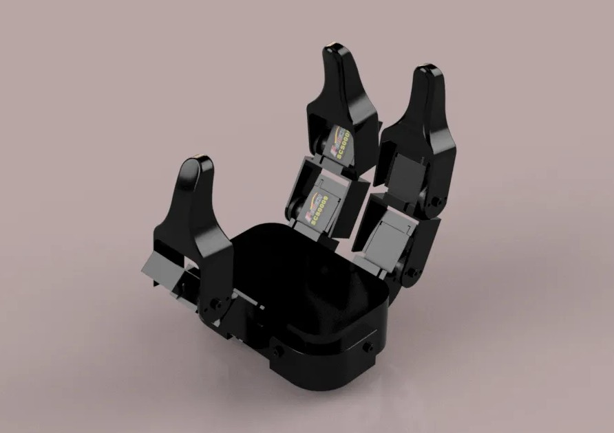
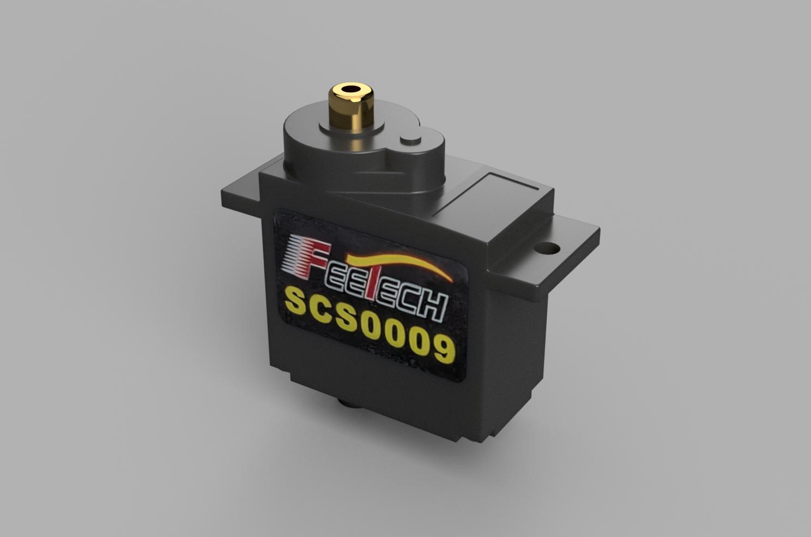
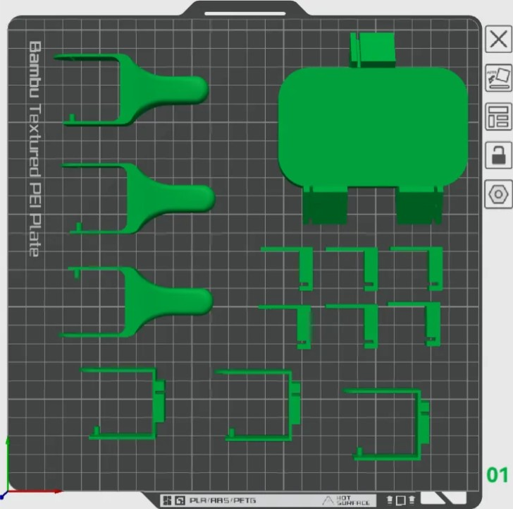

# PathOn Dexterous Hand V2

> ## ⚠️ Reference only — not a buildable release
>
> **V2 is a volunteer-led design and did not go through the same review as [V1](../v1/) and
> [V3](../v3/). We publish it as-is.**
>
> Read [**Known issues**](#known-issues) before printing: the released STL set **cannot reproduce
> the two-servo finger shown in the render below**, and there is **no CAD source** to fix it with.
>
> **If you want a hand you can actually build, use [V1](../v1/).**

A compact, servo-actuated dexterous hand designed for fast prototyping and manipulation research. Built around the **Feetech SCS0009** micro servo. This is **V2** of the PathOn Dexterous Hand. It is also the only version on Feetech servos — see [Servo ecosystem](#servo-ecosystem).

| Isometric view | Servo reference |
|---|---|
|  |  |

## Known issues

Found while assembling a physical V2:

- **The released STLs cannot build the finger in the render.** `media/hand_iso.jpg` shows two
  SCS0009 per finger, but the published parts (`Palm`, `Palm_mount`, `Finger`, `MirroredFinger`,
  `Mountmale`, `Mountfemale`) include no intermediate link that carries the second servo's body on
  the first servo's output. Built from these files, the second servo is grounded to the palm and
  its joint does not articulate — the motor sits still instead of travelling with the joint below
  it. Fixing this needs a new part: first servo's horn → link → second servo's housing.
- **The servo is not fully captured by its mount.** The mount is an open C-channel; the SCS0009
  body protrudes past the printed bracket and is retained by two screws on a single face, so grasp
  side-loads go straight into two printed screw bosses and splay the channel open.
- **No cable routing or strain relief.** Servo leads exit through the joint gap and get pinched as
  the finger closes.
- **No CAD source**, so none of the above can be corrected from this release — `cad/` is an empty
  placeholder. Any change means remodelling from the STLs.
- **No assembly guide and no BOM.** Servo count, fasteners, and the horn/spline interface are
  undocumented.

If you want a hand to actually build, [V1](../v1/) is the released, complete package.

## Servo ecosystem

V2 is the only version on Feetech; V1 and V3 are DYNAMIXEL. The two are not interchangeable and
cannot share a bus, an adapter, or an SDK:

| | V1 / V3 | V2 |
|---|---|---|
| Servo | DYNAMIXEL XL330 / X-series | Feetech SCS0009 |
| Bus protocol | DYNAMIXEL Protocol 2.0 | Feetech SCS serial bus |
| USB adapter | ROBOTIS U2D2 | Feetech FE-URT-1 or TTL linker board |
| SDK | DYNAMIXEL SDK | Feetech SCServo SDK |
| Feedback | position, velocity, current, temperature | position and load; no current sense usable for grasp force |

If you already run a DYNAMIXEL stack, V1 or V3 drops into it and V2 does not. V2's argument is size
and cost, not integration.

## Design Goals

- **Fast to prototype** - servo-actuated joints with a compact printed structure.
- **Small actuator package** - Feetech SCS0009 servos keep the hand lightweight and compact.
- **Simple printable layout** - the bundled 3MF file includes a prepared build plate for the printable parts.

## Specs

| Spec | Value |
|---|---|
| **Fingers** | 3 |
| **Servo model** | Feetech SCS0009 |
| **Print project** | Bambu Studio 3MF |
| **Printable parts** | Palm, palm mount, fingers, mirrored finger, male/female mounts |

## Hardware Files

```
dexterous_hand/v2/
|-- cad/
|   `-- .gitkeep                         # CAD folder kept for V1 structure parity
|-- stl/
|   |-- Palm.stl                         # palm body
|   |-- Palm_mount.stl                   # palm mount
|   |-- Finger.stl                       # finger body
|   |-- MirroredFinger.stl               # mirrored finger body
|   |-- Mountmale.stl                    # male mount
|   |-- Mountfemale.stl                  # female mount
|   |-- Hand-assembled.stl               # assembled hand reference
|   `-- Feetech SCS0009 v9.stl           # servo reference model
|-- 3mf/
|   `-- dex3_hand_v2.3mf                 # Bambu Studio print project
`-- media/
    |-- hand_iso.jpg
    |-- feetech_scs0009_v9.jpg
    `-- print_layout.jpg
```

## Printing

Use the bundled `3mf/dex3_hand_v2.3mf` to load the pre-arranged plate directly in Bambu Studio.



Suggested print settings starting point:

| Setting | Value |
|---|---|
| Material | PLA or PETG |
| Layer height | 0.2 mm |
| Walls | 4 |
| Infill | 25-40% |
| Supports | Tree supports where needed |

> CAD source files are not included in this V2 release. The `cad/` folder is present to mirror the V1 package layout.

## License

Hardware files in this project — CAD, meshes, assembly docs, and photos — are
covered by the [hardware LICENSE](../../../LICENSE), a Standard Digital File License:

- **Personal use** — print, build, and modify these for your own personal,
  non-commercial use.
- **No redistribution** — do not repost the files or printed parts anywhere,
  free or paid, including remixes.
- **No organizational or commercial use** without written permission — this
  applies to companies, schools, and universities alike, and covers selling the
  files or prints *and* using the parts in a product, production line, service,
  course, or lab.

Licensing for organizations, including schools and universities, is available —
contact the copyright holder.
