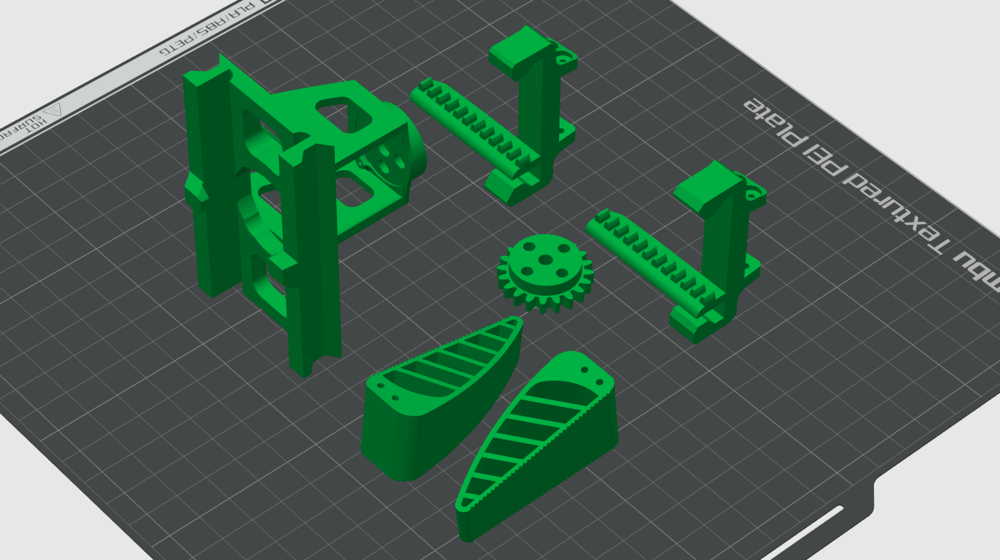
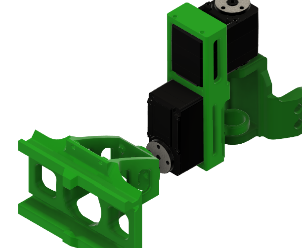
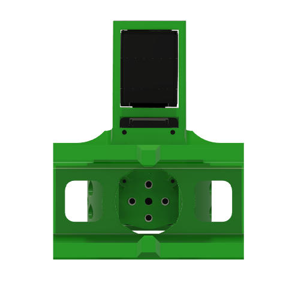
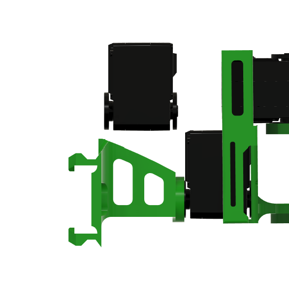
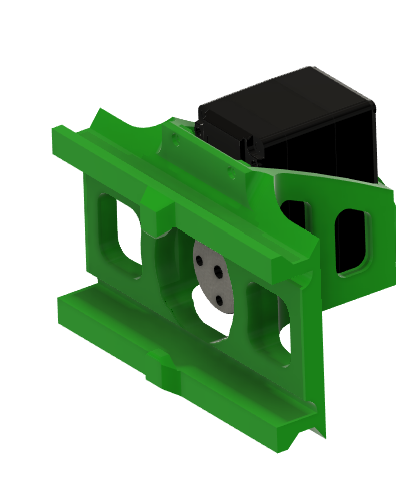
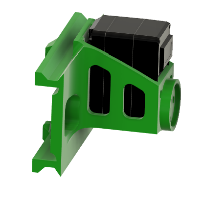
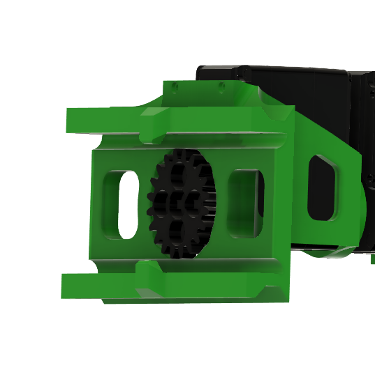
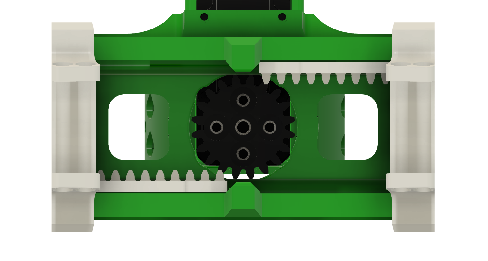
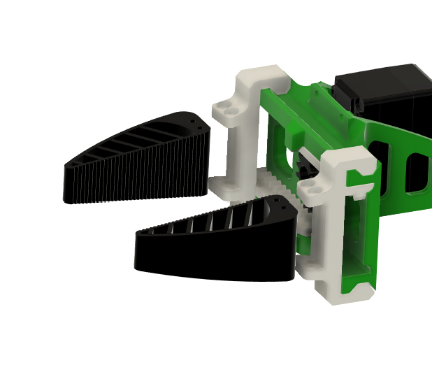
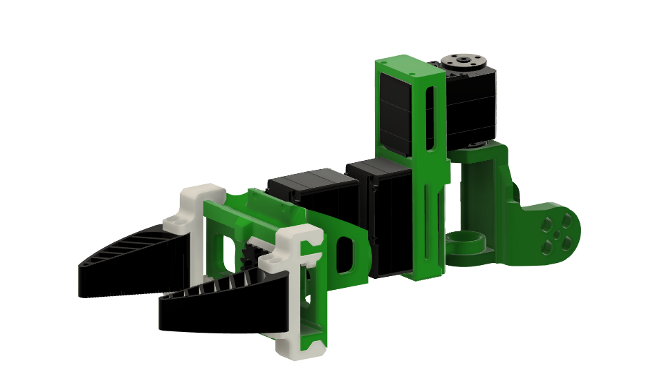

# Hardware -- Assembly Guide (Symmetric Gripper)

> **Prerequisite: the 6DoF wrist upgrade.** The gripper frame mounts onto the **yaw link**
> from [`robots/so101_6dof_wrist/`](../../../robots/so101_6dof_wrist/), not onto a stock
> SO-101. Build that first -- this guide picks up where its Step 4 leaves off.

## Bill of Materials

| # | Part | Qty | Source |
|---|------|-----|--------|
| 1 | STS3215 servo | 1 | Purchased |
| 2 | frame | 1 | 3D printed |
| 3 | cam | 1 | 3D printed |
| 4 | rack_up | 1 | 3D printed |
| 5 | rack_down | 1 | 3D printed |
| 6 | l_gripper | 1 | 3D printed |
| 7 | r_gripper | 1 | 3D printed |

## 3D Printed Parts

All parts can be printed with standard PLA/PETG filament. STL files are for slicing, STEP files are provided for modification.

### Print Orientation

Orient the parts as shown below for optimal layer strength. Parts are positioned so that load-bearing surfaces have layers running perpendicular to the primary stress direction.

  

### Parts

| Part | STL | STEP |
|------|-----|------|
| Frame | [frame.stl](3d_printed_parts/symmetric_gripper/stl/frame.stl) | -- |
| Cam | [cam.stl](3d_printed_parts/symmetric_gripper/stl/cam.stl) | -- |
| Rack (upper) | [rack_up.stl](3d_printed_parts/symmetric_gripper/stl/rack_up.stl) | -- |
| Rack (lower) | [rack_down.stl](3d_printed_parts/symmetric_gripper/stl/rack_down.stl) | -- |
| Left Finger | [l_gripper.stl](3d_printed_parts/symmetric_gripper/stl/l_gripper.stl) | -- |
| Right Finger | [r_gripper.stl](3d_printed_parts/symmetric_gripper/stl/r_gripper.stl) | -- |
| Full Assembly | -- | [Parallel_gripper_assembly.step](3d_printed_parts/symmetric_gripper/step/Parallel_gripper_assembly.step) |

## Assembly

> Step numbering continues from the [wrist guide](../../../robots/so101_6dof_wrist/hardware/),
> which ends at Step 4.

### Step 5 -- Prepare the Gripper Frame

Take the gripper `frame` and position it for mounting onto the yaw link.

  

Place the Frame link onto the bottom servo of the Yaw link servo and secure it with the servo screws.

  

### Step 6 -- Mount the Gripper Servo

***Connect the Servo wire to the STS3215 servo*** and then Insert it into the gripper `frame`. The servo sits in the top cavity of the frame.

  

Secure it with two self tapping screws on the top

  

Secure it with two self tapping screws on the back side above the servo flange cavity

  

### Step 7 -- Install the Cam and Racks

Attach the `cam` gear to the servo output shaft inside the frame. and secure it with screws

  

Then slide `rack_up` and `rack_down` into the frame channels so the cam teeth mesh with both racks.

  

### Step 8 -- Attach the Gripper Fingers

Attach `l_gripper` and `r_gripper` to the ends of the upper and lower racks respectively.

  

### Step 9 -- Completed Assembly

The fully assembled SO-101 6DoF arm with symmetric gripper.

  

