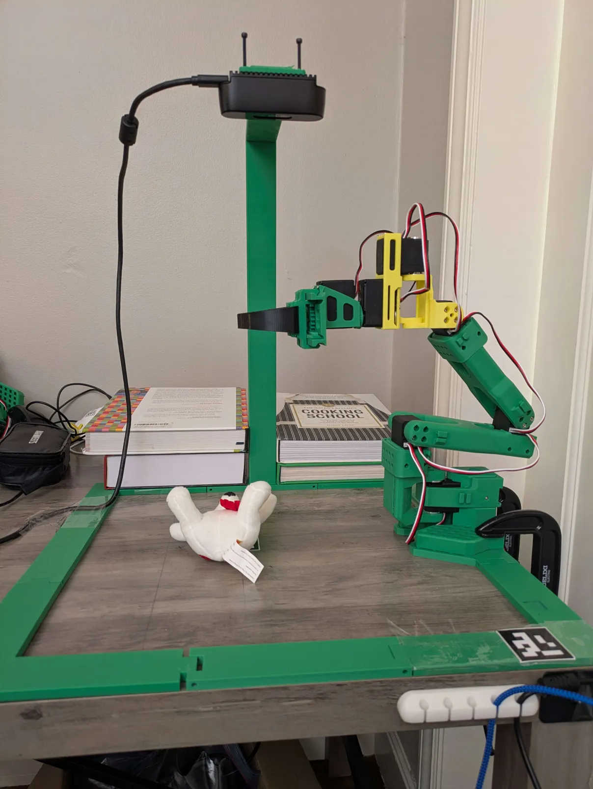

# Symmetric Gripper

A **rack-and-pinion parallel-jaw gripper** where both fingers move equally, so grasping force is balanced about the tool axis rather than pushing the object sideways. Designed for reliable pick-and-place and, together with an any-angle wrist, for feeding poses straight from off-the-shelf grasp-generation models.

  
   
  <em>The gripper fitted to an SO-101 with the 6DoF wrist upgrade.</em>

## Prerequisite -- the 6DoF wrist upgrade

> The gripper frame mounts onto the **yaw link** of the
> [SO-101 6DoF wrist upgrade](../../robots/so101_6dof_wrist/), **not** onto a stock SO-101.
> Build that first. The two parts were designed as one kit and are published separately only
> because they are different kinds of hardware.

## What's Included

- `frame` -- gripper body
- `cam` -- cam mechanism
- `rack_up` / `rack_down` -- rack pair for symmetric motion
- `l_gripper` / `r_gripper` -- left and right finger

STL files for slicing, plus a STEP of the full gripper assembly.

## Simulation models

The URDF and MJCF cover the arm, the 6DoF wrist, and this gripper as a **single kinematic chain**, so there is no gripper-only model. They live with the wrist, at
[`robots/so101_6dof_wrist/software/robot_assets/`](../../robots/so101_6dof_wrist/software/robot_assets/).

## Demos

The demos exercise the complete assembly -- wrist plus gripper -- and are collected on the
[6DoF wrist page](../../robots/so101_6dof_wrist/#demos): vision-language grasping in
simulation and on the real robot, and MoveIt motion planning with point cloud overlay.

## Getting Started

1. Build the [6DoF wrist upgrade](../../robots/so101_6dof_wrist/) first
2. Print the gripper parts -- see [hardware/](hardware/) for files and assembly instructions
3. Fit the gripper to the yaw link, following the guide from Step 5

## License

Hardware files in this project — CAD, meshes, assembly docs, and photos — are
covered by the [hardware LICENSE](../../LICENSE), a Standard Digital File License:

- **Personal use** — print, build, and modify these for your own personal,
  non-commercial use.
- **No redistribution** — do not repost the files or printed parts anywhere,
  free or paid, including remixes.
- **No organizational or commercial use** without written permission — this
  applies to companies, schools, and universities alike, and covers selling the
  files or prints *and* using the parts in a product, production line, service,
  course, or lab.

Licensing for organizations, including schools and universities, is available —
contact the copyright holder.
