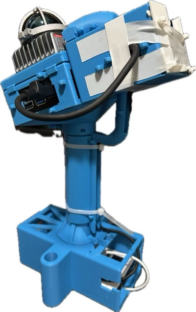

# Handheld 3D LiDAR Scanner

> **Status: placeholder — no files released yet.** This page describes a scanner that is
> built and working, but the CAD source, the printable meshes, and the export tooling have
> not been cleared for release. Nothing in this folder is printable yet. The photo below is
> a real assembled unit; everything else on this page is a description of that unit, not a
> spec sheet you can build from.

A 3D-printable handheld enclosure that turns a **Livox Mid-360** into a self-contained,
walk-around 3D scanner. Sensor, compute, power, and connectivity all ride in one printed
body with a pistol grip and a tripod-style anti-tip base, so a mapping run needs nothing
but the scanner in your hand.

Designed by [tiger-pathon-robotics](https://github.com/tiger-pathon-robotics).

*Assembled unit — Livox Mid-360 on the tilted top plate, Raspberry Pi 5 in the upper body,
power bank in the handle, cable bay behind the front panel.*

## What it holds

| Slot | Hardware |
|---|---|
| Sensor | Livox Mid-360 / Mid-360S, on a top plate tilted 20° rearward |
| Compute | Raspberry Pi 5, fits inside a metal armour / heatsink case, with I/O out the side |
| Power | Power bank, 150 × 68 × 41.5 mm envelope, in the handle |
| Connectivity | 4G LTE USB dongle, in a holster on the rear wall |
| Cabling | Front cable bay spools ~1.5 m of slack plus the M12 aviation connector / Ethernet splitter |

The **20° rearward tilt** is the point of the geometry: the Mid-360's vertical FOV runs
roughly −7° to −52°, so tilting the sensor back swings that cone up and forward into the
space a person walking with the scanner actually wants to map, instead of at their own feet.

## Design notes

- **Parametric under the hood.** The body is modelled as a single parametric source, so
  the sensor tilt, the power-bank envelope, and the print clearances are dimensions rather
  than baked-in geometry. A release would ship the exported meshes and STEP, not the source.
- **~10 printable parts**, toolless where it matters: snap clips on the upper lid, a
  spigot-and-socket mate between handle and bridge locked by a quick-release pin, a snap-on
  raceway cover down the front of the handle, and a slide-on dongle holster.
- **Cable management is part of the enclosure**, not an afterthought — figure-8 spooling
  posts in the front bay, zip-tie strain relief at the M12 plug and the RJ45 port, and a
  printed exit hood over the side cable elbow.
- **FDM-first tolerances** — clearances are sized for a 0.4 mm nozzle and the parts fit a
  256 × 256 mm bed.

## Commercial reference

The closest off-the-shelf equivalent is the [Manifold Pocket2](https://www.3dmanifold.com/products/pocket2/)
(from $3,495) — same idea: a Mid-360-class sensor, an IMU, compute, and a battery in a
handheld grip. Manifold does not name the LiDAR, but the published numbers — 905 nm,
40 m @ 10% / 70 m @ 80% reflectivity, 200,000 points/s, 360° × (−7° to 52°) — are a
line-for-line match to the [Mid-360 datasheet](https://www.livoxtech.com/mid-360/specs).

Where a product like that is ahead is software, not the enclosure: Pocket2 ships three
global-shutter RGB cameras, a proprietary real-time SLAM (MindSLAM), and a cloud
processing suite. This project is the sensor rig — the SLAM stack is the last item on the
list below.

## What a release would contain

- [ ] `stl/` — the printable parts, ready to slice
- [ ] `step/` — neutral CAD for the parts and the full assembly
- [ ] Print settings, fastener and zip-tie BOM, assembly order
- [ ] The scanning software side: Mid-360 driver bring-up on the Pi, LIO/SLAM stack, and
      how point clouds get off the device

Interested in this one, or want to be told when it lands?
[Discord](https://discord.gg/xukJ3nh9wC).
