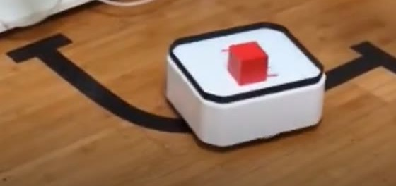

# PathOn AGV — Line-Following Shuttle

> **Status: placeholder — no files released yet.** The AGV is built and running: it appears
> in the Smart Logistics Cell demo, shuttling a load along a taped line between two arms.
> What does not exist yet is anything you could build one from — no CAD, no BOM, no STLs,
> no controller code. The photo below is a frame from that demo, not a render.

A small line-following shuttle that moves material **within a single work cell** in the
PathOn **Smart Logistics Cell** (SLC). One arm loads it, it follows a line taped to the
floor to the next arm, and that arm unloads it. No map, no localization — the route is
physically stuck to the floor.

*The AGV on its taped route in the Smart Logistics Cell, carrying a block between arms. The
tape in the frame is the entire navigation system — there is no map.*

## What it does in the cell

| | |
|---|---|
| **Job** | Shuttling within one work cell — the short leg of the line |
| **Guidance** | Line following: an optical sensor tracks tape on the floor |
| **Localization** | None. It does not know where it is, only whether it is on the line |
| **Handoff** | Arm loads at one end, arm unloads at the other |
| **Trade-off** | Cheap and dependable, and the route cannot change without re-laying tape |

## Why a line follower is still the right answer sometimes

It would be easy to read the AGV as the lesser robot next to the
[AMR](../amr/). It is not — it is the correct choice for a large share of real plant
transport, where the same load moves between the same two points every shift for years.
Nothing about that job rewards a map. Tape is cheap, an optical line sensor is nearly
impossible to confuse, and the failure modes are few and obvious.

The interesting engineering is in what a line follower gives up: it stops when something
blocks it, it cannot be rerouted from software, and every route change is physical work on
the floor. Put it beside the AMR on one line and students can watch both sides of that
trade in a single run — which is exactly why the SLC ships both.

## What a release would contain

- [ ] Chassis and deck CAD, plus printable meshes
- [ ] BOM: drive, wheels, battery, line sensor, controller
- [ ] Line-following controller, and how the sensor array is read and tuned
- [ ] Stop and handoff logic — how it knows it has arrived at an arm
- [ ] Tape layout guidance: turn radii, junctions, stop markers
- [ ] The deck interface it shares with the AMR, so loads and fixtures interchange

Interested in this one, or want to be told when it lands?
[Discord](https://discord.gg/xukJ3nh9wC).

## License

Hardware files in this project — CAD, meshes, assembly docs, and photos — are
covered by the [hardware LICENSE](../../LICENSE), a Standard Digital File License:

- **Personal use** — print, build, and modify these for your own personal,
  non-commercial use.
- **No redistribution** — do not repost the files or printed parts anywhere,
  free or paid, including remixes.
- **No organizational or commercial use** without written permission — this
  applies to companies, schools, and universities alike, and covers selling the
  files or prints *and* using the parts in a product, production line, service,
  course, or lab.

Licensing for organizations, including schools and universities, is available —
contact the copyright holder.
