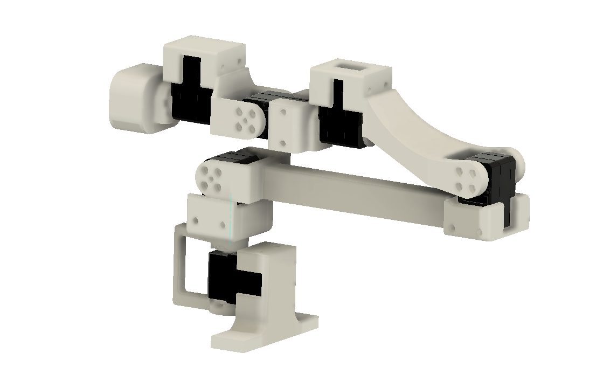
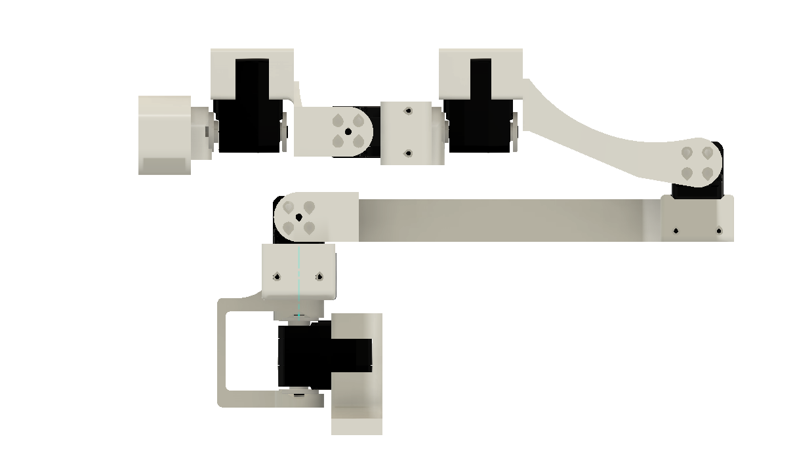

# Piper Leader Arm

A 3D-printable 6-DOF leader arm for teleoperation, built around Feetech SCS215
serial bus servos. Several structural parts are shared with the
[SO-101 6DoF wrist upgrade](../so101_6dof_wrist/) design.

| Isometric view | Side view |
|---|---|
|  |  |

## Demo

https://www.loom.com/share/76692481e2974dc4ab211c4a76d80e24

*Teleoperating a Piper arm with the PathOn Robotics 3D-printed Piper leader arm.*

## Specs

| Spec | Value |
|---|---|
| **DOF** | 6 |
| **Servos** | 6 × [Feetech SCS215](https://www.feetechrc.com/) serial bus servo |
| **Protocol** | TTL serial bus (daisy-chained) |
| **Feedback** | Position, velocity, load, voltage, temperature |
| **Gripper** | Squeeze trigger at the wrist |
| **Largest part** | 220 mm — fits a 256 mm bed (Bambu A1 / P1S) |

## Printed parts

Dimensions in mm, from the STL bounding boxes.

| File | Bounding box (X × Y × Z) |
|---|---|
| [`stl/base.stl`](stl/base.stl) | 91.2 × 24.5 × 58.2 |
| [`stl/shoulder.stl`](stl/shoulder.stl) | 57.0 × 50.4 × 78.2 |
| [`stl/upper_arm.stl`](stl/upper_arm.stl) | 219.9 × 24.0 × 50.1 |
| [`stl/lower_arm.stl`](stl/lower_arm.stl) | 135.4 × 66.6 × 53.4 |
| [`stl/pitch.stl`](stl/pitch.stl) | 77.9 × 51.9 × 47.4 |
| [`stl/roll_1.stl`](stl/roll_1.stl) | 30.2 × 30.6 × 50.0 |
| [`stl/roll_2.stl`](stl/roll_2.stl) | 37.9 × 51.0 × 35.0 |

## Files

```
piper_leader/
├── cad/
│   └── piper_leader.step    # full assembly (STEP), mm
├── stl/                     # printable parts (binary STL)
│   ├── base.stl
│   ├── shoulder.stl
│   ├── upper_arm.stl
│   ├── lower_arm.stl
│   ├── pitch.stl
│   ├── roll_1.stl
│   └── roll_2.stl
└── media/
    ├── piper_leader_iso.webp
    └── piper_leader_side.webp
```

## Software

Use the [Feetech SCServo SDK](https://github.com/Kotakku/FTServo_Python) or the
servo debugging tool to assign servo IDs before first run.
