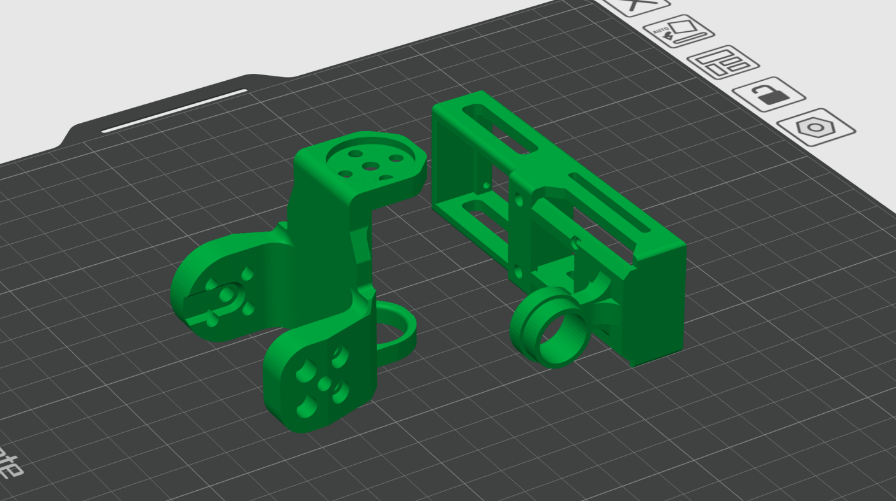
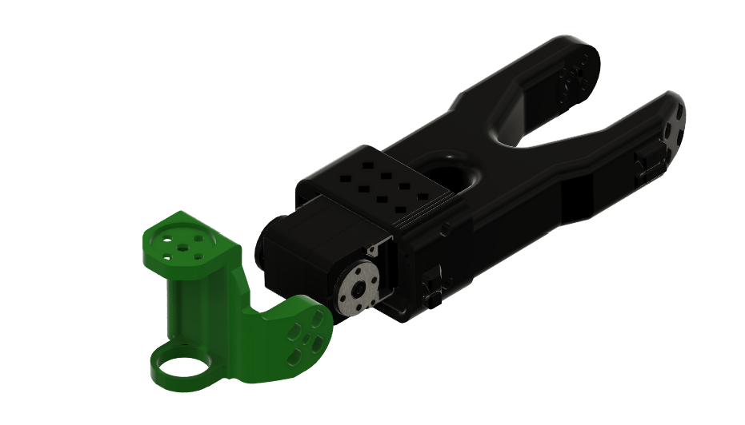
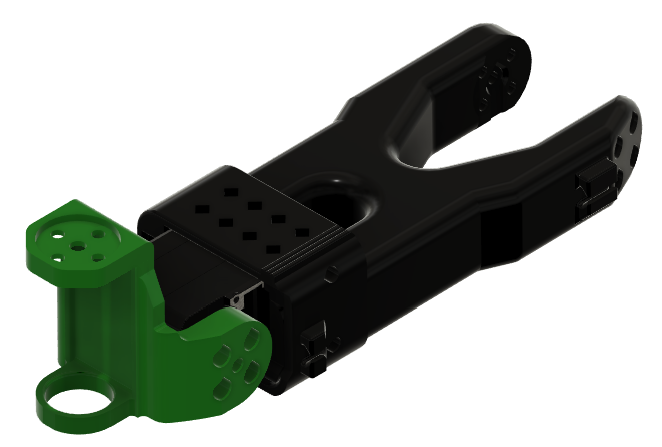
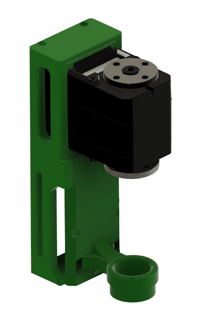
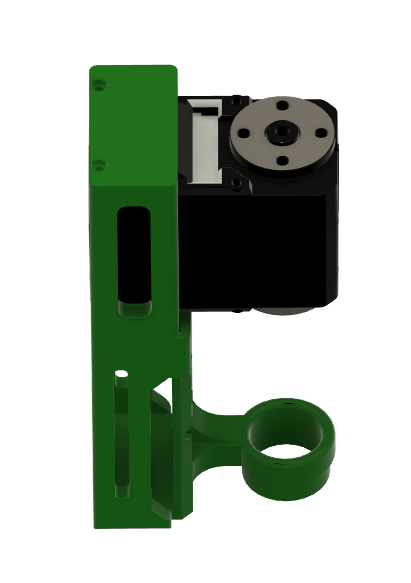
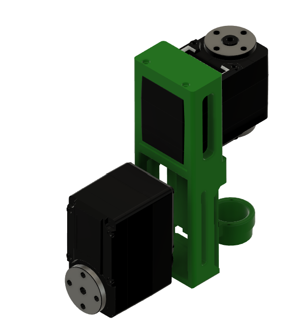
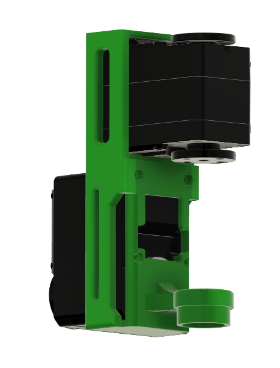
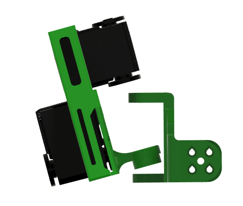
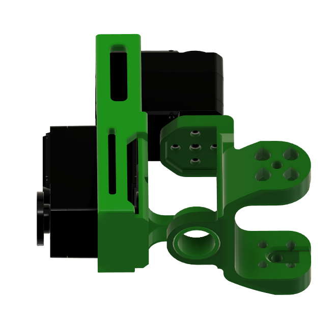

# Hardware -- Assembly Guide (6DoF Wrist Upgrade)

This guide covers the **6DoF wrist upgrade** only. To fit the matching parallel-jaw
gripper afterwards, continue with
[`end_effectors/so101_symmetric_gripper/`](../../../end_effectors/so101_symmetric_gripper/) --
its frame mounts onto the yaw link you build here.

## Bill of Materials

### 6DoF Wrist Upgrade BOM

| # | Part | Qty | Source |
|---|------|-----|--------|
| 1 | STS3215 servo | 1 | Purchased |
| 2 | link_pitch | 1 | 3D printed |
| 3 | link_yaw | 1 | 3D printed |

## 3D Printed Parts

All parts can be printed with standard PLA/PETG filament. STL files are for slicing, STEP files are provided for modification.

### Print Orientation

Orient the parts as shown below for optimal layer strength. Parts are positioned so that load-bearing surfaces have layers running perpendicular to the primary stress direction.

  

### Parts

| Part | STL | STEP |
|------|-----|------|
| Wrist Pitch Link | [link_pitch.stl](3d_printed_parts/6dof/stl/link_pitch.stl) | [link_pitch.step](3d_printed_parts/6dof/step/link_pitch.step) |
| Wrist Yaw Link | [link_yaw.stl](3d_printed_parts/6dof/stl/link_yaw.stl) | [link_yaw.step](3d_printed_parts/6dof/step/link_yaw.step) |

## Assembly

### Step 1 -- Attach the Pitch Link to the SO-101 Arm

Mount the `link_pitch` onto the last servo of the SO-101 arm using the servo horn.

  

Secure the pitch link using the servo screws so it rotates freely on the pitch axis.

  

### Step 2 -- Install the Yaw Servo

Insert an STS3215 servo into the `link_yaw` mount. The servo should sit flush inside the yaw link.

  

Secure the STS3215 servo by 2 self tapping screws from the servo pack

  

### Step 3 -- Attach the Roll Servo

Connect the `link_yaw` assembly with the bottom servo.

  

Secure the bottom servo with the 4 self tapping screws.

  

### Step 4 -- Fix yaw to pitch

The completed wrist assembly with both pitch and yaw links attached to the SO-101 arm.

  

Attach the Yaw servo horn to the top face of the pitch link and secure it with screws

  

The wrist upgrade is now complete. To fit the gripper, continue with the
[symmetric gripper assembly guide](../../../end_effectors/so101_symmetric_gripper/hardware/).
