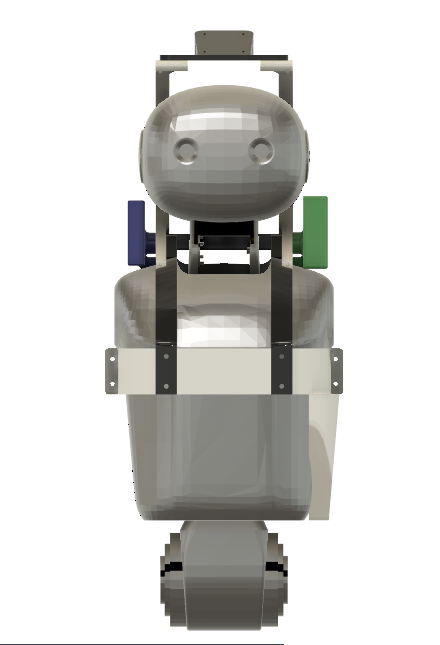
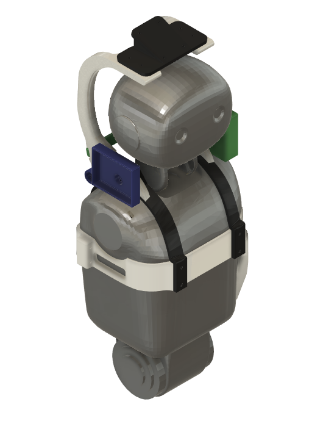
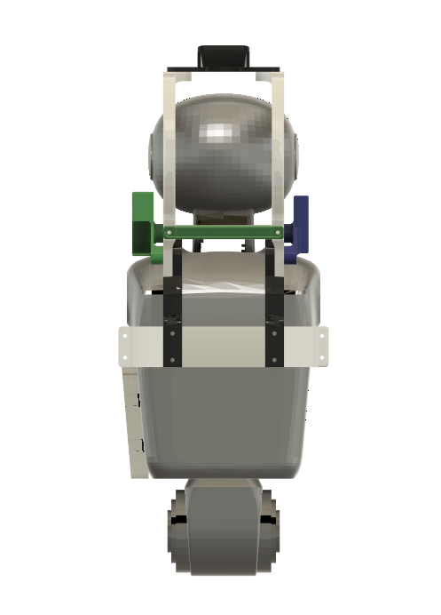

# K1

3D-printable hardware kit for the K1 robot — body frame, mounts for LiDAR / Raspberry Pi / battery, and printable shoes.

| Front | Isometric | Back |
|---|---|---|
|  |  |  |

## Hardware Files

```
k1/
├── stl/
│   ├── frame/                # body structure
│   │   ├── L_main_FRONT.stl  # main body — front shell
│   │   ├── L_main_BACK.stl   # main body — back shell
│   │   ├── L1.stl, L2.stl    # side frame brackets
│   │   ├── beam.stl          # cross beam
│   │   └── t1.stl, t2.stl    # top / handle parts
│   ├── mounts/               # accessory mounts
│   │   ├── lidar_mount_k1.stl
│   │   ├── pi_mount.stl      # Raspberry Pi mount
│   │   └── battery_mt.stl    # battery mount
│   └── shoes/
│       ├── left_shoe_v3.stl
│       └── right_shoe_v3.stl
└── media/
    ├── front.png
    ├── isometric.png
    └── back.png
```

## Printing

Suggested print settings (starting point — tune for your printer):

| Setting | Value |
|---|---|
| Material | PLA or PETG |
| Layer height | 0.2 mm |
| Walls | 4 |
| Infill | 25–40% (gyroid) |
| Supports | Tree, only where needed |

> Print shoes in PETG or TPU for better grip and durability.
